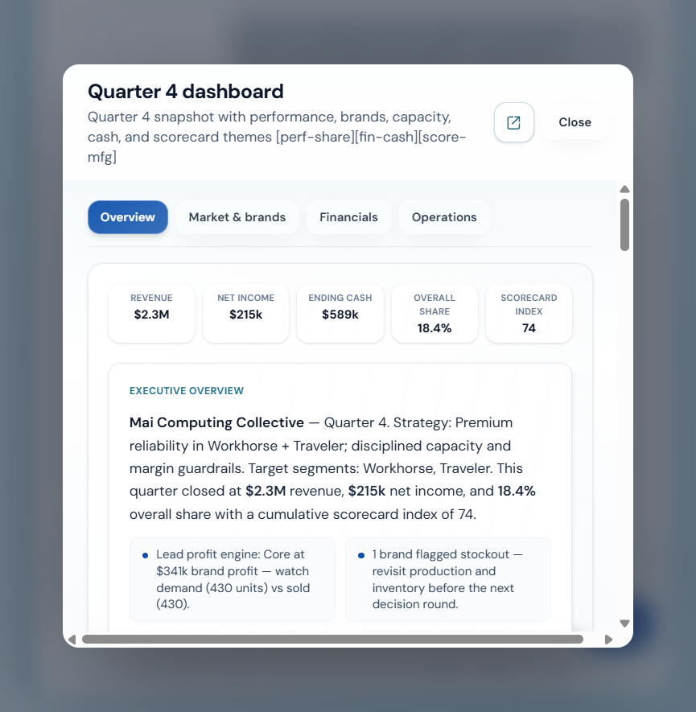
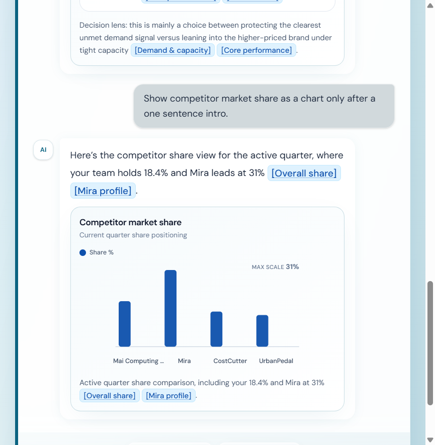
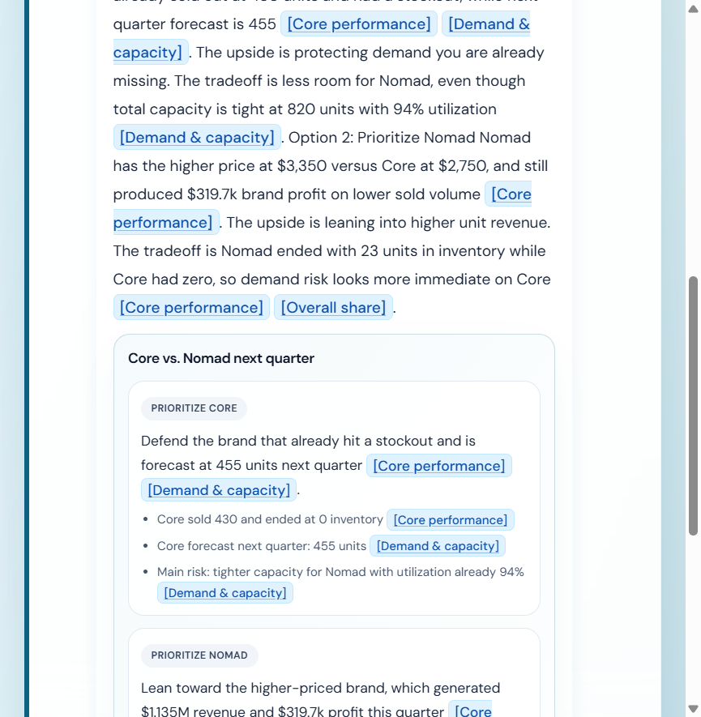

# Round 1: Written proposal (Teaching Innovations Con 2025 / Marketplace AI Competition)

**Product name:** Marketplace Analyst  

**Live demo:** [https://marketplace-analyst.vercel.app](https://marketplace-analyst.vercel.app)

This package goes a modest step beyond a text only answer: it already points to a live Vercel deployment you can click through, so the submission doubles as an early showcase of what the project looks like and how it behaves in a browser, not only as a written concept.

I am aware that Marketplace Simulations already ships an AI coach style experience inside its platform. What I am arguing here is that this design is a fuller and more helpful companion for the kind of work students do in the simulation: it is more visual, more flexible in how it presents evidence, and built to keep answers grounded in the quarter snapshot through citations and widgets, which can also make outcomes feel more accurate than a plain text chat alone for numeric, report heavy work.

Use this document as your source for the Paperform fields. You can trim paragraphs to fit word limits; keep the three organizer questions answered in your own words if you split content across fields.

---

## Suggested title

**Marketplace Analyst: grounded decision support for simulation performance and strategy**

---

## 1. How are businesses currently using your AI idea in the workforce?

Real teams already lean on a mix of structured numbers and language models when they have to move fast on performance reviews, variance stories, competitive moves, capacity and demand risk, and “what changed” questions before a leadership meeting. The pattern is straightforward even when the vendors and product names change: dashboards and ERP style systems hold the truth, retrieval or tools keep the model tied to that truth, and the model adds short explanations, comparisons, and ways to phrase tradeoffs so people can decide faster without pretending the spreadsheet went away.

That is the same muscle as an internal briefing or a planning meeting where someone says “here is what moved, here is what worries me, here are two ways to read it,” except the computer can sit in the loop for drafts and follow up questions. The job title on the org chart might say finance, operations, or strategy, but the work is still interpretation and preparation, with humans responsible for the final call. Marketplace Analyst is our student facing version of that habit: help the learner see the story in the data, not outsource the strategy game.

---

## 2. How could this type of AI be incorporated into a Marketplace simulation?

Picture the student between rounds with the same reports you already expect them to read, except they can ask in ordinary language what matters for their team this quarter and get answers that stay short and tied to the numbers that are actually loaded for their run. Marketplace Analyst would live inside that flow as a coach panel next to the workspace, not a separate homework site.

The prototype shows what that feels like. The coach screen opens on the active quarter and team so nobody is guessing which snapshot they are talking about. The student can open source notes that list the same kinds of facts they would hunt for in performance, manufacturing, and finance, each line labeled so the chat can later point back to the right place in the workspace.

When source notes are expanded, those entries read like a lightweight index tied to the demo snapshot, which is the same spirit as “here is what we indexed from your quarter” in a real integration.

From there the student asks whatever helps the team prep the next decision, and the assistant is written to stay in decision support mode on purpose: plain language, options and tradeoffs, no magic optimal move. In the build we ship, one tap can ask for a quarter level dashboard inside the thread so the reply carries a compact preview with revenue, share, net, and a path to go deeper.

Opening that preview’s button brings up the fuller dashboard overlay with tabs for overview, market and brands, financials, and operations, so the “where does it live” answer is easy to show to a judge: beside the same KPI trail the course already rewards, only with a guided readout and room to cross check.

The coach can also render dedicated widgets inside the thread. Below is an example chart widget for competitor market share, and an example tradeoff comparison panel for strategic options.

Finally, the citations in chat are meant to land in the same module shell students already navigate in the simulation style UI. The workspace view below is the other half of the story: the coach is not a floating chatbot, it is the voice layer on top of reports they still need to be able to read and defend.

After results post, during debrief, and before locking inputs, that is the rhythm we are aiming for, and across the term it reinforces evidence based reasoning for presentations and team defense the same way a manager backs a plan with numbers in the room.

---

## 3. What AI tools or applications could be used to support this idea?

We built the demonstration with a normal web stack so it is easy to host and inspect. The browser talks to one origin that serves the React interface and the API routes. On the server we compile the live snapshot into text, run lightweight retrieval over that text for the user’s question, and call OpenAI through the Responses style flow with function tools wired to the same snapshot so KPI pulls are not invented in free text. Vercel runs the static build and the small serverless handlers for chat and health, with secrets kept off the client. None of that is exotic compared with what a university or vendor team could maintain for a pilot.

What analysis or generation happens in practice is a mix of structured reads and narration: the model explains share, cash, manufacturing pressure, and scorecard movement, and when a chart or a tradeoff panel helps, the UI renders those as first class blocks instead of hiding the data in a single blob of text. What the student receives is readable language, optional visuals, and links they can click to walk from an answer into the part of the workspace that holds the proof.

For learning, that lines up with “tell me what changed, show me the risk, give me two ways to think about it,” which is closer to workplace analytics copilots tied to ERP or BI than to a toy that prints a single best strategy. The live demo linked at the top is the reference build for those claims.

---

## Feasibility

The idea is incremental by design: attach a coach UI to structured simulation state, add retrieval and tool backed reads, ship on standard hosting. That is a reasonable scope compared with building a full autonomous agent that pretends to run an entire firm. The demo above is already public so reviewers can click instead of imagining wireframes.

---

## Supporting materials and link

Screenshots for this proposal live under `assets/` including names starting with `r1-proposal-` and `r1-proposal-widget-` for production captures, together with the existing `submission-*.png` set if you need alternates.

**Live demo:** [https://marketplace-analyst.vercel.app](https://marketplace-analyst.vercel.app)
