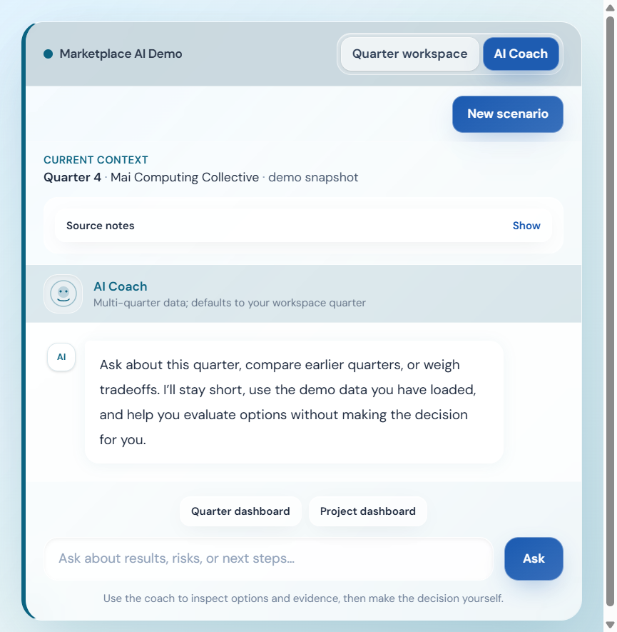
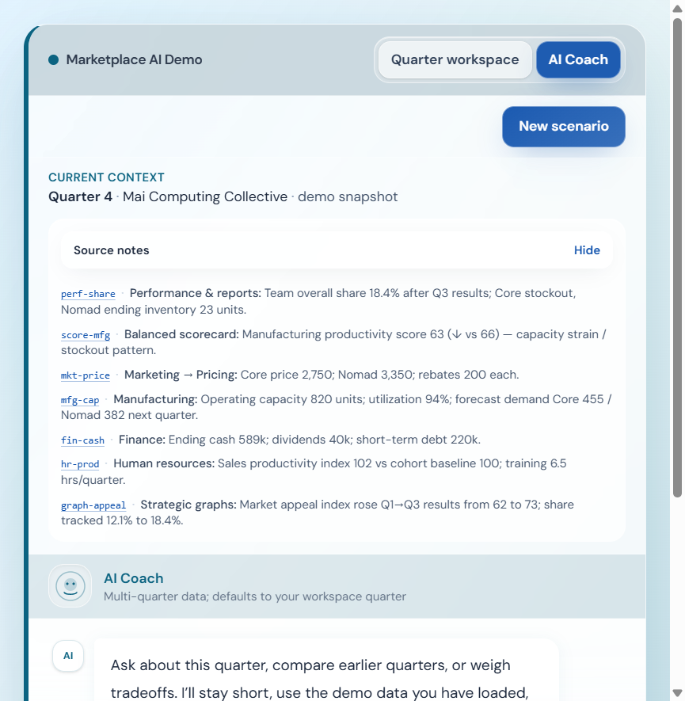
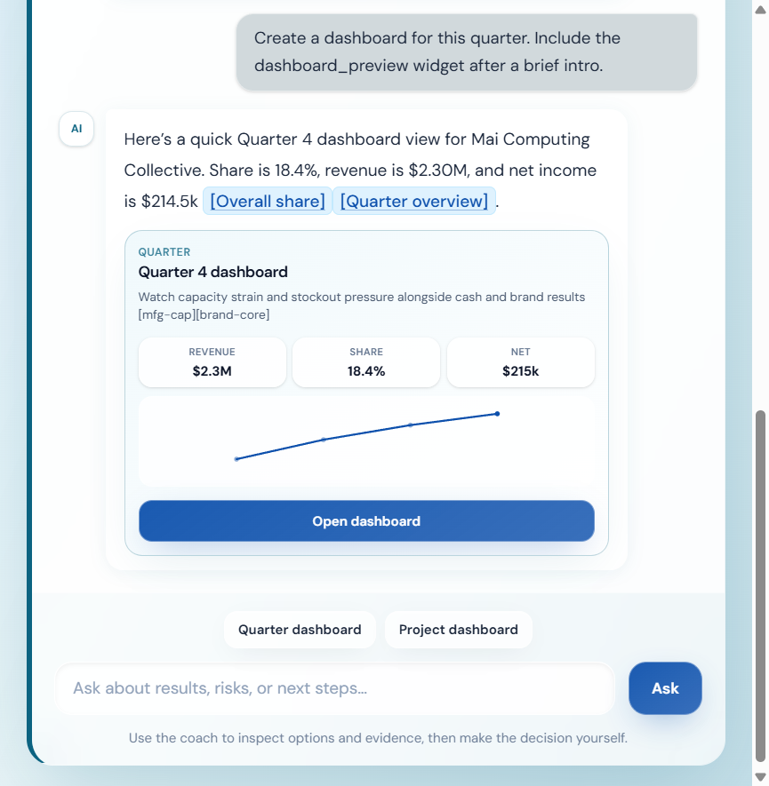
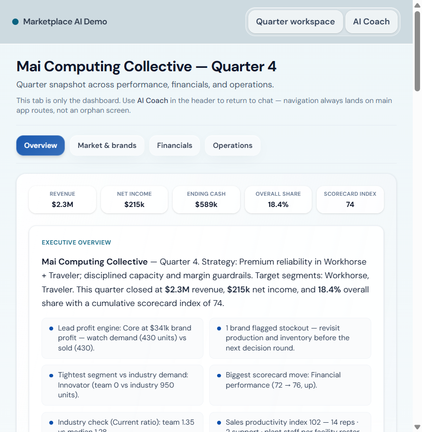
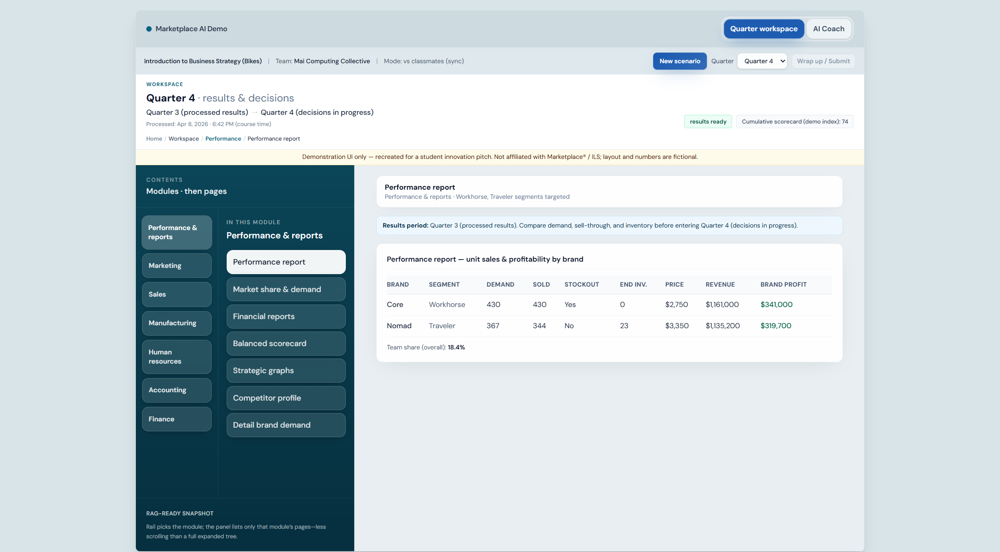

# Round 2: Prototype and evidence package

Round 2 asks for a working prototype, a clear sense of where the idea sits inside Marketplace, and supporting materials such as code, how often students would use it, and visuals. This document is the paste up source for that package when the organizer sends final Round 2 instructions. The same human, evidence first story as Round 1 applies: **Marketplace Analyst** is decision support tied to the quarter, not a bot that picks the winning strategy for the student.

**Live demo:** [https://marketplace-analyst.vercel.app](https://marketplace-analyst.vercel.app). Optional sanity check for hosts: `GET https://marketplace-analyst.vercel.app/api/health`.

---

## Working prototype and public code

The prototype you can grade in a browser is the deployment above. Source code is public at [https://github.com/AlexGiurea/marketplace-analyst](https://github.com/AlexGiurea/marketplace-analyst) under the MIT license. The React client lives in `frontend/` with routes for the AI Coach at `/`, the quarter style workspace at `/workspace`, and the full coach style dashboard at `/dashboard`. Server side chat, retrieval, and OpenAI tools live in `server/`. Vercel style entrypoints for production are `api/chat.ts` and `api/health.ts`, with root `vercel.json` and `package.json` describing install and build.

---

## Where it lives and how often students would use it

In a full Marketplace integration, students would use Marketplace Analyst whenever they are already reading results or aligning on the next round: right after results post when the team debriefs what changed, in the planning window before they lock decisions when they care about capacity, demand, margin, and cash, and any time they want a shared language for a slide or an instructor conversation. Frequency is essentially “whenever they would open a report or ask a teammate to explain a table,” except the coach is instant and stays scoped to their team and quarter as long as the sim passes that context through.

Placement in the product could be a panel or slide out beside Performance, Financial, or Manufacturing views, or a dedicated Analyst area in the sim chrome. Authentication and team context would match the live simulation so the model always sees that team’s state, not a generic page.

The captures below are from the current production app so judges can see the same surfaces students would have next to reports. The coach home shows quarter and team context plus paths into richer views.

Source notes tie chat facts to workspace destinations before the student even types a question.

The in thread dashboard preview and the full dashboard route show how a “briefing” layer sits on top of the same KPIs the course already teaches.

The workspace view is the other half of the placement story: citations from chat are meant to connect to this shell so analysis and reading assignments stay in one mental space.

---

## Mockups and extra visuals

The working UI is the mockup. For slides or PDF handouts you can reuse files in `assets/`, including the `submission-*.png` series and the `r1-proposal-*.png` series from the production capture pass, and the audit note in [submission-audit-2025.md](./submission-audit-2025.md). If you want a single downloadable architecture page, `marketplace-analyst-showcase.html` at the repo root is available to host or print; it is not bundled into the Vite app by default.

---

## What to tell judges about capability and stack

For a concise feature story aimed at judges, shorten or adapt the language in [submission-messaging-kit.md](./submission-messaging-kit.md). Technically, the client sends the scenario, active quarter index, and message list to `POST /api/chat`. The server compiles snapshot knowledge, retrieves relevant chunks for the question, and calls OpenAI with tools bound to the live snapshot so figures are not invented as free text. The UI parses assistant replies for fenced `coach-widget` JSON and square bracket citations so charts and links render as first class content. Vercel builds the static app, rewrites client routes to `index.html`, and runs the API as serverless functions.

---

## Video

Narration and beat by beat actions are in [submission-round-2-demo-script.md](./submission-round-2-demo-script.md).

---

## Terms

Use the official competition terms link your organizer publishes for the cohort when the submission form requires it.
